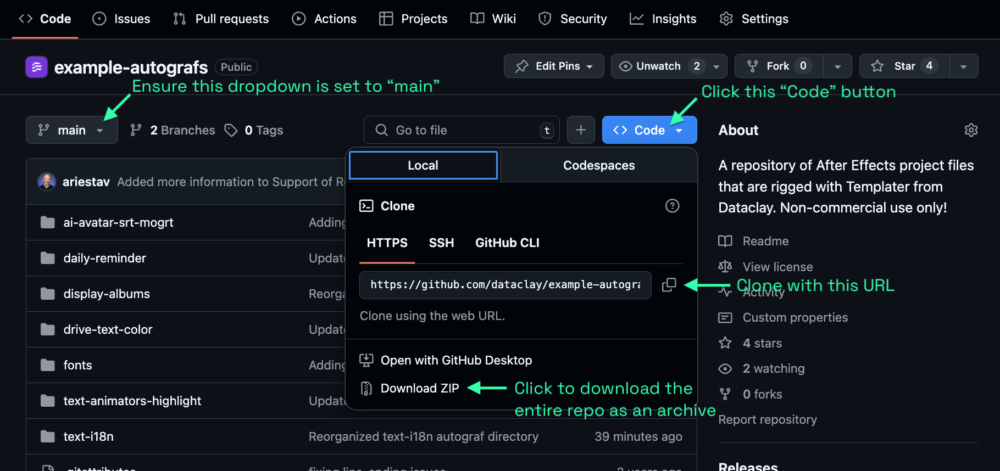
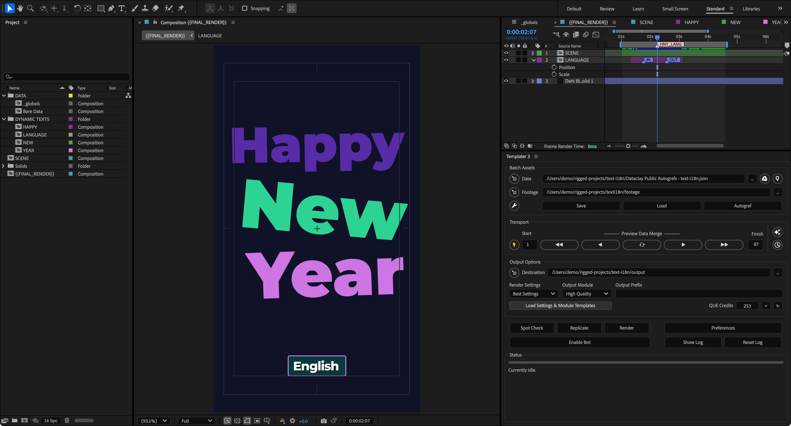
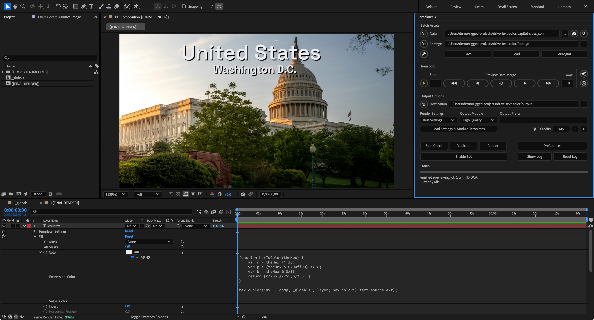
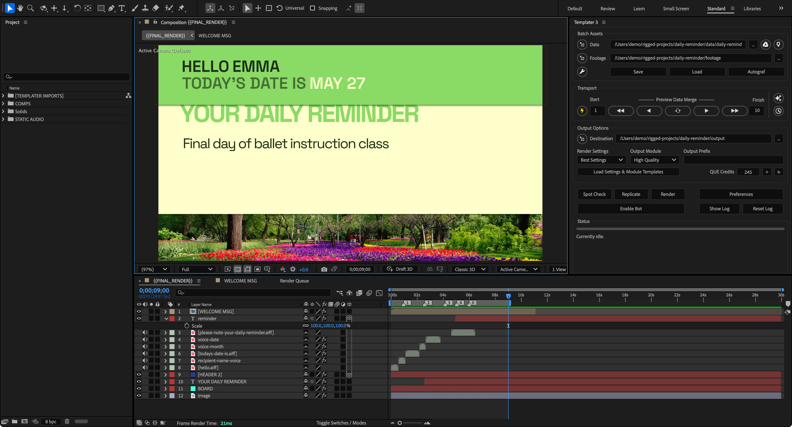
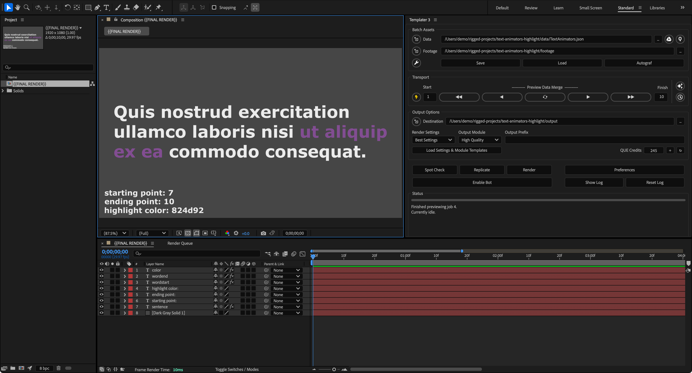
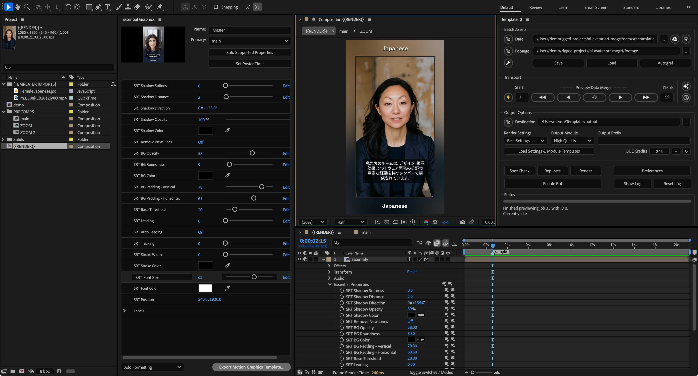

# Autograf Examples

👋🏼 Welcome to Dataclay's repository of example Autografs™︎ to help you hit the ground running with Templater® for Adobe After Effects®.  The intention of this repository is to help new Templater users understand the possibilities for automating video content creation. 

These examples focus on the technical side of rigging layers and comps for automation which means their visual design has taken a back seat 😃 — so please forgive the lack of quality in the actual motion design. Our hope is that you take what you learn from inspecting these Autografs and go on to build beautiful, energetic, dynamic compositions driven by data.

If you would like to see commercially available Autografs available to license, please [visit Dataclay's marketplace](https://dataclay.com/autografs) to see some truly beautiful designs with impressive technical rigging.

## What is an Autograf?

An Autograf is an After Effects project authored with Dataclay's Templater plugin. It is an After Effects project that is prepared for automatic versioning and rendering.

In most cases, Autografs ship with:
+ an After Effects project file prepared for Templater automation, and
+ sample data that is structured according to how the author rigged the Autograf.

## Who are these Autografs for?

Assets in this repository are intended for Templater users 😎 who want to learn various rigging techniques for transforming their static, non-dynamic, After Effects projects into Autografs that Templater can automatically version and render.

## How to use these Autografs

1. **Get a local copy of this repository onto your machine.**\
When viewing this page on GitHub, ensure the branch is set to *main* as shown in the screenshot.  Then click the **Code** button to clone or download this repository into a directory on  your local drive where your After Effects application is installed.

2. **Open an Autograf inside of After Effects.**\
Launch AE and go to **File > Open** and choose the `.aep` file within the Autograf's `/projects` sub-directory.\
\
⚠️ **IMPORTANT NOTE:** The Autograf project files may be built in a version of After Effects that is different from the version installed on your machine.  If you have a newer version of AE installed, but open an `.aep` file built in an earlier version, AE will automatically upgrade the project file to be compatible with the newer version of AE.  You will need to re-save the converted project file in order for it to work with Templater.  Unfortunately, you cannot open a newer `.aep` file in an older version of After Effects. If you can, please use the `.aep` files for After Effects 2025 as the ones prior to that version may not be setup in accordance to the instructions in this readme.  You can still use the older `.aep` files, but they will require adjustments to the data, footage, and output fields in Templater's main panel.

3. **Connect Templater to some sample data.**\
Once you have the project file open inside AE, launch the Templater panel by going to **Window > Templater X.jsxbin**.  In the launched Templater panel, within the *Batch Assets* group of controls, at the right of the *Data* field, click the **[...]** button to open a file picker dialog and navigate to the Autograf's sub-directory and choose a `.json` file containing sample data found in the Autograf's `data` folder. [Learn more about the data source types that work with Templater](https://support.dataclay.com/templater/content/concepts/data/data_source.htm).\
\
💡**TIP** While the repository includes local JSON files for the Autografs, Dataclay maintains [a public, view-only, Google Sheet](https://docs.google.com/spreadsheets/d/1s387ATPBfFk_ZYHTysx5tvjbcaQDBqbLAqt2McyFmIM/copy?usp=sharing) that can also be used with Templater.  To use it as Templater's data source, first make a copy of it to your Google Drive account. Then, link Templater to that copied Sheet by clicking the **Google Drive** icon button and follow the on-screen instructions to sign in and authorize Templater to link to the specific worksheet tab for the Autograf you are working with.

4. **Set a footage root directory.**\
In the *Batch Assets* group of controls, at the right of the *Footage* field, click the **[...]** button to open a file picker dialog and choose the `footage` folder within the Autograf's sub-directory.  [Read more about Templater's source footage root](https://support.dataclay.com/templater/content/concepts/workflow/source_footage_location.htm).

5. **Preview the data in your comp.**\
In the *Transport* group of controls, specify a range of versioning jobs you want to preview.  To kick things off, enter `1` into the *Start* field and then `10` into the *Finish* field.  This means that Templater will only preview data for job `1` through job `10`.  Adjust these values at anytime to change the range of jobs that you want Templater to preview.  Next, click on any of the arrow buttons within the *Transport* controls to traverse through the data to see how it looks in the main comp.  [Learn more about previewing data inside your comps](https://support.dataclay.com/templater/content/how_to/production/previewing_a_composition.htm).

6. **Process the data into new output.**\
First, in the *Output Options* group of controls, click the **[...]** button to the right of the *Destination* field to open a file picker dialog.  Then, choose the `output` folder within the Autograf's sub-directory.  Next, click **Load Settings & Module Templates** to load AE's *Render Settings* and *Output Modules* into the dropdown menus. By default, *Best Settings* and *High Quality* are selected, but you can choose the ones for your preference.  Finally, click on either **Spot Check**, **Replicate**, or **Render** in the main Templater panel to begin processing the connected data into new output. [Learn more about Templater's output destination](https://support.dataclay.com/templater/content/concepts/output/output_location_and_assets.htm).

7. **View the outputs**\
After batch processing finishes, click the navigate button to the left of the *Destination* field to open the destination folder.  You will see the outputs in that directory.

## Included Assets

Each example Autograf is organized in sub-folders. The following Autografs are included:

### text-i18n

>
>A very basic starter Autograf to help you with text internationalization (i18n) in your video compositions.  It uses an animated "Happy New Year" phrase as the basis for translation.  If you need help building an Autograf for text translation, start with this project.  With this Autograf, you will see how to set fonts from a data source, and how to connect guide text layers to expression code.  Review [the local JSON file](/text-i18n/data/text-i18n.json) that works with this Autograf.

### drive-text-color

>
> See how to change a text layers' fill color from Templater's connected data source using expression code applied to a fill effect.  While connected to [a tiny sample data set of capital cities](drive-text-color/data/capitol-cities.json), this extremely bare bones example will get you familiar with how you can easily use data in your expression code. You will also see basic data mapping to footage layers.

### daily-reminder

>
>A very basic Autograf for a short "daily reminder" video.  It was built to showcase the rudimentary basics of [Dataclay's Time Sculpting technique](https://support.dataclay.com/templater/content/concepts/time/time_sculpting.htm). The audio layers are mapped to references of footage assets with varying duration for each versioned output. By inspecting the audio layers' *Templater Settings* effect, within the *Time* group of params, you will see how parameter settings can cause different layers to shift in time when Templater swaps audio footage assets.  It also showcases color theming by utilizing expression code on various composite elements that make use of a single HEX value.

### display-albums

>
>The very first Autograf built with Templater!  This is a relic from the Templater 1.0 days, but it still works flawlessly. It shows text, footage, and solid layers mapped to a sample data set of music albums by various artists. Some references to footage assets in [the sample data](display-albums/data/albums.json) are invalid by design so you can see how Templater handles faulty footage.  You can also see what the purpose of the `target` property is when performing batch output operations.  With the `target` property, [you can have Templater output a specific composition](https://support.dataclay.com/templater/content/concepts/output/target_composition.htm) within the project.

### text-animators-highlight

>
>A skeleton Autograf for understanding how to use Templater, together with After Effects' Text Animators tools, to control fill colors of a range of words within a text layer.  This know-how is frequently requested by Templater users, so dive in to learn the ins and outs of the technique. [Read more about this technique](https://forums.dataclay.com/topic/154/tip-using-text-animators-and-expressions-to-create-a-highlight-effect) on the Dataclay forums, too!

### ai-avatar-srt-mogrt

>
>As one of the more advanced examples, this Autograf showcases how Templater updates subtitles, stored in referenced SRT files, as it processes its connected data.  It also showcases how Templater can [update a pre-comp's *Essential Properties*](https://support.dataclay.com/templater/content/how_to/data/dynamicessentialproperties.htm) from its connected data source.  You can also see how to use remote footage sources for content inside the Autograf.  This example uses lip-sync animations created with [HeyGen](https://www.heygen.com) from avatars created with [MidJourney](https://midjourney.com). The included SRT data files were exported from the HeyGen videos using [whisper-video](https://github.com/IOriens/whisper-video) which uses OpenAI to convert spoken audio to speech on a local machine.

## Other resources for learning

If you want the real nitty gritty on Templater, head over to [our official documentation](https://support.dataclay.com), join and participate in the [Dataclay Forums](https://forums.dataclay.com), or watch our videos on [the @dataclay YouTube channel](https://youtube.com/dataclay).

## Contributing

At Dataclay, on of our goals is to create a community of motion designers and developers who want to keep push video automation techniques forward. Do you have an awesome Autograf that you want to share with the community?  If so, feel free to setup a folder structure for your Autograf in the following manner:

+ `My Beautiful Autograf`\
  The root of your Autograf can hold a preview image of what it looks like when opened inside After Effects, similar to the preview images in this readme.  You can also provide a `README.md` file that explains how to use your Autograf.

  - `/projects`\
    A subfolder that holds your After Effects project file you authored with Templater.

  - `/data`\
    A subfolder that holds sample data in JSON format.  Your sample data set can be small or large — usually a minimum of about ten rows and a maximum of 100 work well for sample data.

  - `/footage`\
    A subfolder that holds any static footage assets used in the AE project or referenced from the data source.  Please consider the byte size of the assets as storage can become an issue upon committing.

  - `/output`\
    A placeholder subfolder users can reference for Templater's output destination. This repository's `.gitignore` will not track any digital assets within the `/output` folder, but it's useful to have as a placeholder for Templater's users.

## Support

Thank you for testing out these Autografs with Templater!  If you find they do not work for you, please feel free to 